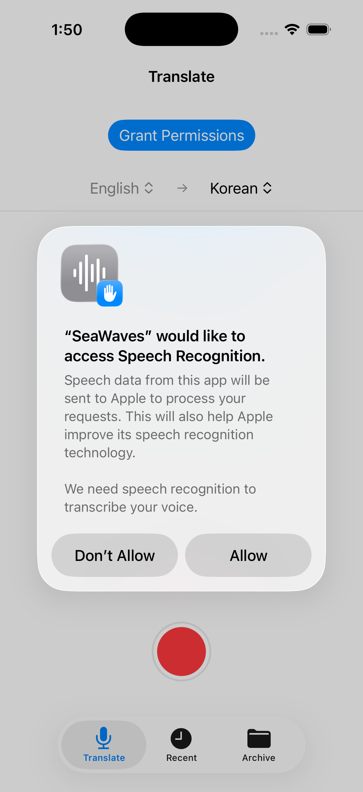

# SeaWaves 🌊🐢

SeaWaves is a modern, on-device translation and live-transcription iOS app designed for effortless, real-time cross-language communication.

## Features

- **Live Translation Timeline:** Speak naturally and watch your sentences drop into a beautiful, native-feeling timeline interface.
- **Continuous Reactive Audio:** A dynamic waveform visually confirms when the app is actively listening to you.
- **Dynamic VAD (Voice Activity Detection):** Smart chunking automatically commits sentences based on natural pauses and detected terminal punctuation.
- **Background DB Migrations:** SwiftData effortlessly manages your transcripts.
- **Native SwiftUI:** Buttery smooth performance using `LazyVStack` and true MVVM architecture.
- **No Internet Required:** Powered entirely by Apple's on-device `Translation` framework.

## Setup

1. Clone the repository and open `SeaWaves.xcodeproj` in Xcode 16+.
2. Select your signing team under the 'Signing & Capabilities' tab.
3. Build and run on your physical iOS 18 device (or the simulator, though on-device is recommended for microphone and haptic support).
4. **Note:** On your first run, iOS will securely prompt you to download the required offline language models.

## Support
Built by Bret Lindquist using the power of local LLMs.
